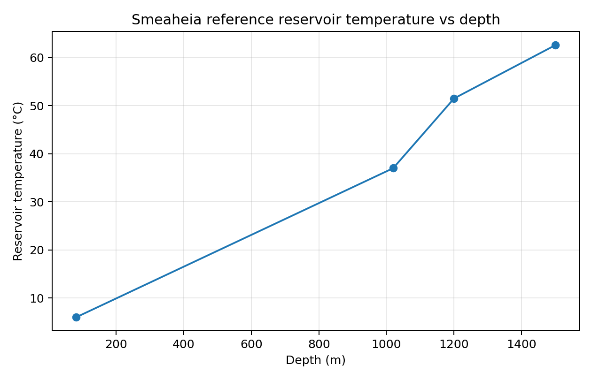
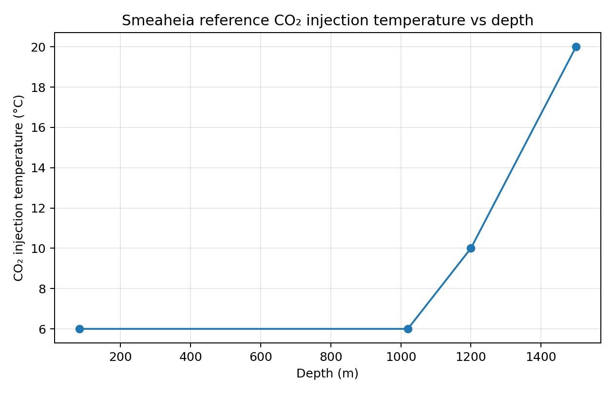
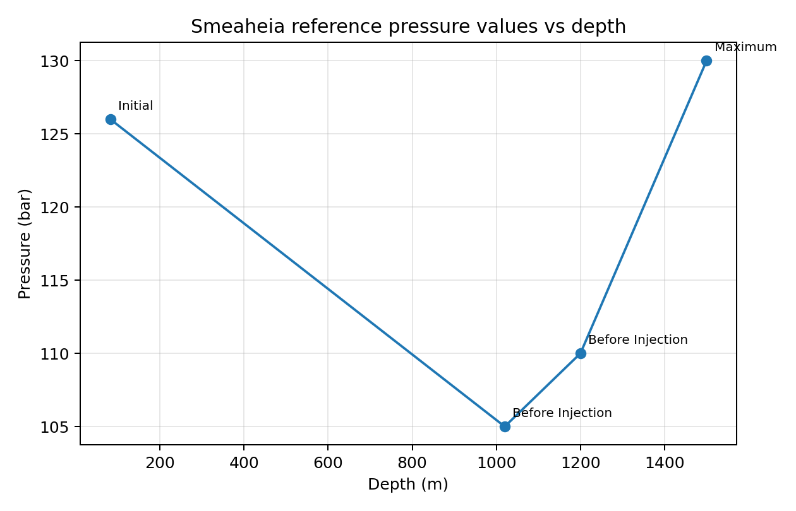

# Smeaheia Pressure–Temperature Reference Analysis

This project performs a small descriptive analysis of four pressure/temperature reference points adapted from the open Smeaheia Dataset on CO2DataShare.

The purpose is to practise transparent handling and visualisation of subsurface reference data. It is not a predictive model, storage-capacity calculation, injection simulator, or reservoir-pressure model.

## What changed from the earlier version

The earlier repository used a four-point train/test linear-regression exercise and made statements such as “pressure decreases with depth.” Those claims were not defensible:

- four points are too few for a meaningful train/test predictive model;
- the pressure values are non-monotonic across the four rows (126, 105, 110 and 130 bar);
- the rows carry different pressure-state labels (`Initial`, `Before Injection`, `Maximum`), so they should not be treated as one hydrostatic or reservoir-pressure gradient;
- a simple depth × temperature interaction term does not represent CO₂ storage efficiency.

The corrected repository therefore keeps the useful part: data provenance, cleaning, tabulation and descriptive visualisation.

---

## Data source and licence

**Source dataset:** Smeaheia Dataset, CO2DataShare  
**Dataset DOI:** `10.11582/2021.00012`  
**Contributors / rights holders:** Equinor and Gassnova  
**Dataset licence:** SMEAHEIA DATASET LICENSE  
**Dataset page:** https://co2datashare.org/dataset/smeaheia-dataset  
**Pressure/temperature resource:** https://co2datashare.org/dataset/smeaheia-dataset/resource/7481b930-0eb5-4819-9f81-5dbfbba6a722  
**Licence page:** https://co2datashare.org/view/license/26af9426-203f-4993-9d41-2e1bf191ceaf

CO2DataShare describes this resource as containing reservoir temperature gradients, CO₂ injection temperatures at wellhead/reservoir depth, and reservoir-pressure evolution information used in the Smeaheia studies.

The small Excel file in this repository is an adapted/extracted table from that material. The data remain subject to the SMEAHEIA DATASET LICENSE. The repository's Apache-2.0 `LICENSE` applies to the analysis code/documentation only and does not replace the dataset licence.

Credit: **Equinor and Gassnova, Smeaheia Dataset, CO2DataShare.**

---

## Adapted reference table

| Depth (m) | Reservoir temperature (°C) | CO₂ injection temperature (°C) | Pressure (bar) | Pressure type |
|---:|---:|---:|---:|---|
| 82 | 6.0 | 6 | 126 | Initial |
| 1020 | 37.0 | 6 | 105 | Before Injection |
| 1200 | 51.5 | 10 | 110 | Before Injection |
| 1500 | 62.6 | 20 | 130 | Maximum |

Because these four rows represent different reference conditions/states, the plots are descriptive only.

---

## Repository structure

```text
.
├── README.md
├── Smeaheia_Pressure_Temperature_Reference_Analysis.ipynb
├── requirements.txt
├── .gitignore
├── LICENSE
├── data/
│   └── smeaheia_pressure_temperature_reference.xlsx
└── images/
    ├── reservoir_temperature_vs_depth.png
    ├── co2_injection_temperature_vs_depth.png
    └── pressure_reference_vs_depth.png
```

---

## Descriptive results

### Reservoir temperature vs depth



The four reference values show higher reservoir temperature at greater listed depth. With only four adapted points, this is shown as a descriptive relationship; no calibrated geothermal-gradient model is fitted.

### CO₂ injection temperature vs depth



The listed injection-temperature reference values are 6, 6, 10 and 20 °C. These are retained as source reference values; the repository does not infer injection design requirements or phase behaviour from them.

### Pressure vs depth



The pressure values are not monotonic with depth: 126, 105, 110 and 130 bar. The associated labels also differ (`Initial`, `Before Injection`, `Maximum`). The plot must therefore not be interpreted as a single pressure gradient.

---

## What this project demonstrates

- Reading and cleaning a small adapted subsurface dataset
- Preserving source-state labels during analysis
- Separating descriptive observations from unsupported predictive or causal claims
- Producing transparent depth-based visualisations in Python

---

## Limitations

- Only four adapted reference rows
- Mixed pressure states/conditions
- No reservoir simulation
- No pressure-transient analysis
- No calibrated geothermal-gradient model
- No CO₂ phase-behaviour calculation
- No storage-capacity or storage-efficiency calculation
- No machine-learning or predictive claim

---

## How to run

```bash
pip install -r requirements.txt
```

Open and run:

```text
Smeaheia_Pressure_Temperature_Reference_Analysis.ipynb
```

---

## Author

**Anuri Nwagbara**  
*Geological Engineer*
